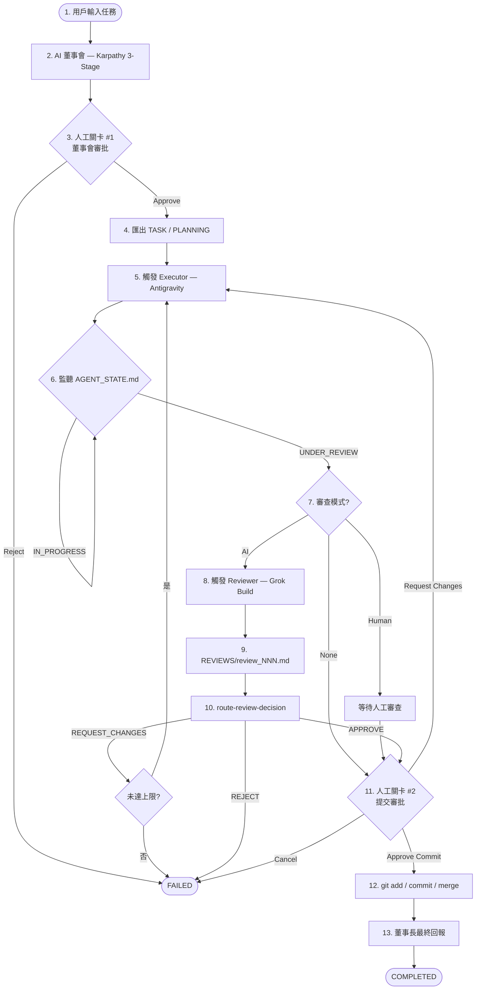

# MAW 最終規格：自主董事會—執行者—審查者工作流

> **版本**：1.0  
> **狀態**：合併規格（小A Antigravity + 小O Openwork）  
> **預設模式**：**安全模式**（雙人工審批關卡）  
> **最後更新**：2026-06-21

---

## 1. 目標

將 MAW 從「被動的 Karpathy 匯出適配器」升級為**可獨立運行的自主 AI 工作流引擎**：

1. 用戶向**董事長**描述任務意圖。
2. MAW 在本地執行 **Karpathy 三階段董事會**（多模型獨立回答 → 匿名互評 → 董事長彙整）。
3. 用戶審閱董事會決議後，MAW 將計畫匯出至目標專案並觸發**執行者（Antigravity）**。
4. 執行者完成後，MAW 依審查政策觸發**審查者（Grok Build）**。
5. 依審查結果進入修復迴圈，或進入提交前審批。
6. 用戶確認後，MAW 執行 Git commit/merge，並由**董事長**產出最終回報。

**可攜性**：下載 MAW 資料夾即可運行（需另備符合合約的目標專案與 API 金鑰）。

---

## 2. 角色與職責

| 角色 | 實作 | 職責 |
|------|------|------|
| **用戶** | MAW UI | 描述任務、審批董事會計畫、審批提交、接收最終回報 |
| **組織者** | `loop_orchestrator.py` | 狀態機、子程序調度、超時/迴圈限制、崩潰恢復 |
| **董事會成員** | OpenRouter 多模型 | Stage 1 獨立作答、Stage 2 匿名排名 |
| **董事長（開會）** | Chairman 模型 | Stage 3 彙整可執行計畫與驗收標準 |
| **執行者** | 目標專案 `trigger_antigravity.py` | 在目標 repo 實作程式碼 |
| **審查者** | 目標專案 `trigger-review.js` | 程式碼審查，產出 `REVIEWS/review_NNN.md` |
| **董事長（結束）** | Chairman 模型 | Commit 後對比需求與變更，撰寫完成報告 |

> **命名原則**：UI 統稱「董事長」涵蓋 Stage 3 與最終回報；「組織者」指 MAW 內部編排器，不對用戶暴露。

---

## 3. 運作模式

### 3.1 安全模式（預設）

不可逆操作前**必須**經過人工確認：

```
用戶輸入 → 董事會 → [人工關卡 #1] → 匯出 → 執行者 → 審查 → 修復迴圈*
         → [人工關卡 #2] → Git Commit/Merge → 董事長回報 → 完成

* 僅在 REQUEST_CHANGES 且未達迴圈上限時發生
```

| 關卡 | 觸發時機 | 用戶動作 | 通過後 |
|------|----------|----------|--------|
| **#1 董事會審批** | Stage 3 完成 | Approve / Reject | 匯出 TASK + 啟動執行者 |
| **#2 提交審批** | 審查 APPROVE | Approve Commit / Request Changes / Cancel | Git 操作或回到執行 |

### 3.2 進階全自動模式（需明確開啟）

僅在以下條件**同時**滿足時跳過人工關卡：

| 設定 | 效果 |
|------|------|
| `auto_approve_council: true` | 跳過關卡 #1，董事會完成即匯出並啟動執行者 |
| `require_pre_commit_approval: false` **且** `ALLOW_AUTO_COMMIT=true`（伺服器 env） | 跳過關卡 #2，審查 APPROVE 後直接 commit |

> 進階模式適合 CI/測試環境；**生產環境預設關閉**。

---

## 4. 端到端流程



---

## 5. 核心設計原則

| 原則 | 說明 |
|------|------|
| **自含董事會** | Karpathy 三階段邏輯內嵌於 `MAW/council/`，不依賴外部 Karpathy 專案 |
| **目標專案擁有執行腳本** | `trigger_antigravity.py`、`trigger-review.js`、`route-review-decision.js` 留在目標專案；MAW 僅調用 |
| **本地紀錄不入 Git** | `TASKS/`、`PLANNING/`、`REVIEWS/`、`AGENT_STATE.md` 在目標專案 `.gitignore` 中排除 |
| **用戶控制董事會** | UI 可選董事會成員模型與董事長模型 |
| **安全預設** | 雙人工關卡、迴圈上限、子程序超時、優雅失敗狀態 |
| **即時可見** | WebSocket 串流執行者/審查者 stdout/stderr |
| **可測試** | Mock 董事會 + Mock 目標腳本，免 API 費用跑 E2E |

---

## 6. 目標專案合約

有效目標專案必須提供：

```
<target-project>/
├── AGENT_STATE.md              # 中央任務登錄簿
├── TASKS/                      # 任務 markdown
├── PLANNING/                   # 董事會紀錄與最終報告
├── REVIEWS/                    # 審查報告
├── scripts/
│   └── trigger_antigravity.py  # 啟動執行者
├── agent-runner/
│   ├── trigger-review.js       # 啟動審查者
│   └── route-review-decision.js # 解析審查決策（輸出結構化 JSON）
└── .gitignore                  # 必須忽略 MAW 產生的檔案
```

### 6.1 必要 `.gitignore` 條目

```gitignore
# MAW-generated local records (do not commit)
AGENT_STATE.md
TASKS/
PLANNING/
REVIEWS/
*.tmp
.maw_export.lock
```

### 6.2 啟動驗證

MAW 啟動時對 `~/.agent-cowork/targets.json` 中每個專案執行 `validate_target()`，回報**精確缺失項目**（非僅「無效」）。

董事會開始前亦應預檢目標專案，避免花費 API 後才在匯出階段失敗。

---

## 7. MAW 目錄結構

```
MAW/
├── .env                          # OPENROUTER_API_KEY, 超時/迴圈預設
├── .env.example
├── .gitignore
├── pyproject.toml
├── main.py                       # FastAPI REST + WebSocket
├── export.py                     # 原子匯出至目標專案
├── loop_orchestrator.py          # 工作流狀態機
├── council/                      # 內嵌 Karpathy 引擎
│   ├── __init__.py
│   ├── config.py                 # 預設模型、MAW_MOCK_MODE
│   ├── openrouter.py             # 異步 OpenRouter 客戶端（重試/退避）
│   ├── council.py                # 3-Stage 會議邏輯 + mock mode
│   └── storage.py                # data/conversations/ 讀寫
├── data/
│   ├── conversations/            # 董事會 JSON 紀錄
│   └── workflows.json            # 工作流狀態持久化
├── template_target_project/      # 可運行的 mock 目標專案範本
├── static/
│   └── index.html                # 五面板工作流 UI
├── start.sh
└── FINAL_SPEC.md                 # 本文件
```

首次啟動自動建立 `data/` 與 `data/conversations/`（`ensure_data_dirs()`）。

---

## 8. 狀態機

```
IDLE
  ↓ 用戶建立任務
COUNCIL_RUNNING
  ↓ 董事會完成
COUNCIL_PENDING_APPROVAL        ← 人工關卡 #1
  ↓ 用戶 Approve
EXPORTED
  ↓ 寫入目標專案
EXECUTOR_RUNNING
  ↓ AGENT_STATE.md → UNDER_REVIEW
REVIEW_PENDING / 人工審查等待
  ↓
REVIEW_RUNNING
  ↓ REVIEWS/review_NNN.md 產生
REVIEW_DECISION_PENDING
  ├─ REQUEST_CHANGES ──→ EXECUTOR_RUNNING  （迴圈，上限 N 次）
  ├─ APPROVE ───────────→ COMMIT_PENDING_APPROVAL  ← 人工關卡 #2
  └─ REJECT ───────────→ FAILED
  ↓ 用戶 Approve Commit
COMMITTING
  ↓ git add / commit / merge
COMPLETED
  ↓ 董事長撰寫最終報告
FINAL_REPORT_PRESENTED
```

### 8.1 安全限制（預設值）

| 參數 | 預設 | 說明 |
|------|------|------|
| `MAX_REVIEW_ITERATIONS` | 3 | `REQUEST_CHANGES` 迴圈上限 |
| `EXECUTOR_TIMEOUT_SECONDS` | 600 | 執行者子程序超時 |
| `REVIEWER_TIMEOUT_SECONDS` | 300 | 審查者子程序超時 |

超限 → `FAILED`，附 `reason` 與完整子程序 log。

### 8.2 審查政策（每任務可配置）

| 模式 | 行為 |
|------|------|
| **None** | 執行者進入 `UNDER_REVIEW` 後跳過審查，直接進關卡 #2 |
| **AI** | 自動觸發 Grok Reviewer + `route-review-decision` |
| **Human** | 等待人工審查；提供 API/UI 提交決策，**不**自動觸發 AI 審查者 |

---

## 9. 元件規格

### 9.1 `council/` — 內嵌董事會

**Stage 1**：各模型獨立回答用戶請求。  
**Stage 2**：各模型匿名排名 Stage 1 回答（須正確映射 Response A/B/C → 模型索引）。  
**Stage 3**：董事長綜合 Stage 1 + Stage 2 產出執行計畫。

輸出 JSON schema 與既有 `export.py` 相容：`stage1`、`stage2`、`stage3`、`metadata`。

**Mock mode**：`MAW_MOCK_MODE=1` 或請求 `mock: true` 時回傳確定性假資料，不呼叫 OpenRouter。

### 9.2 `export.py` — 原子匯出

寫入（順序重要）：

1. `AGENT_STATE.md` 登錄列 → `IN_PROGRESS`
2. `PLANNING/council_NNN.json` + `council_NNN.md`
3. `TASKS/task_NNN.md`（最後寫入，觸發監聽）

保留 `.maw_export.lock` 防併發寫入碰撞。

### 9.3 `loop_orchestrator.py` — 組織者

職責：

- 持久化 `data/workflows.json`
- 子程序調度（`start_new_session` + `killpg` 超時清理）
- WebSocket 廣播 log 與狀態
- 輪詢 `AGENT_STATE.md` / `REVIEWS/`（子程序完成後立即檢查，輪詢作為崩潰恢復備援）
- 在人工關卡暫停
- Git 操作失敗 → `FAILED`（不可靜默忽略 merge 失敗）

審查決策解析優先順序：

1. `route-review-decision.js` 輸出的 JSON 行 `{"decision":"APPROVE|REQUEST_CHANGES|REJECT"}`
2. 錨定正則 `\bDECISION:\s*(...)\b`
3. 獨立行精確 token

### 9.4 `main.py` — API

#### REST

| Method | Path | 說明 |
|--------|------|------|
| GET | `/api/maw/config` | 預設模型、mock 狀態 |
| GET | `/api/maw/targets` | 目標專案列表 + 合約驗證結果 |
| POST | `/api/maw/conversations/new` | 啟動董事會（回傳 `conversation_id` / `workflow_id`） |
| GET | `/api/maw/conversations/{id}` | 董事會詳情 |
| POST | `/api/maw/conversations/{id}/approve` | 人工關卡 #1 — 匯出並啟動執行者 |
| POST | `/api/maw/conversations/{id}/reject` | 拒絕董事會計畫 |
| GET | `/api/maw/workflows` | 列出所有工作流 |
| GET | `/api/maw/workflow/{task_num}/status` | 狀態 + log |
| POST | `/api/maw/workflow/{task_num}/approve-commit` | 人工關卡 #2 — Git 提交 |
| POST | `/api/maw/workflow/{task_num}/request-changes` | 提交前要求修改（僅 `COMMIT_PENDING_APPROVAL`） |
| POST | `/api/maw/workflow/{task_num}/human-review-complete` | 人工審查模式提交決策 |
| POST | `/api/maw/workflow/{task_num}/cancel` | 取消工作流 |
| POST | `/api/maw/export` | 舊版匯出 API（向後相容） |

#### WebSocket

| Path | 說明 |
|------|------|
| `WS /ws/workflow/{task_num}` | 即時 log + 狀態更新（增量，避免重複 append） |

### 9.5 `static/index.html` — 五面板 UI

玻璃擬物風（Glassmorphism）儀表板：

| 面板 | 內容 |
|------|------|
| **1. 董事會建立** | Prompt、模型多選、董事長下拉、審查政策、目標專案 |
| **2. 董事會結果** | Stage 1 各模型回答、Stage 2 **匿名**排名、Stage 3 董事長決議、Approve/Reject |
| **3. 管線追蹤器** | `董事會 → 執行者 → 審查 → (修復迴圈) → 提交審批 → 完成`；當前節點高亮動畫 |
| **4. 即時終端** | WebSocket log；自動捲動至最新 |
| **5. 提交前報告 Modal** | 任務 ID、**實際 git diff 檔案列表**、審查決策、董事長摘要；Approve Commit / Request Changes / Cancel |

UI 行為要求：

- `POST /conversations/new` 回傳的 `workflow_id` 用於追蹤，**不可**用「第一個 PENDING_APPROVAL」猜測
- Mock 模式由 `/api/maw/config` 決定預設，生產環境預設 `mock: false`
- Stage 2 顯示匿名標籤（Evaluator N），模型名稱放可展開詳情

---

## 10. 各階段詳細流程

### 10.1 董事會階段

1. 用戶提交 prompt、模型選擇、審查政策、目標專案。
2. 預檢 `validate_target()`；失敗則立即回報，不消耗 API。
3. 狀態 → `COUNCIL_RUNNING`；執行 Stage 1 → 2 → 3。
4. 儲存至 `data/conversations/{id}.json`。
5. 狀態 → `COUNCIL_PENDING_APPROVAL`；通知 UI。

### 10.2 人工關卡 #1

- **Approve**：`export_to_target()` → 觸發 `python3 scripts/trigger_antigravity.py --task-num NNN` → `EXECUTOR_RUNNING`
- **Reject**：→ `FAILED`

### 10.3 執行者階段

- 串流 stdout/stderr 至 WebSocket
- 監聽 `AGENT_STATE.md` 狀態變為 `UNDER_REVIEW`
- 依審查模式分支（見 §8.2）

### 10.4 審查階段（AI 模式）

```bash
node agent-runner/trigger-review.js NNN
node agent-runner/route-review-decision.js NNN
```

| 決策 | 動作 |
|------|------|
| `REQUEST_CHANGES` | 若未達上限：重設 `IN_PROGRESS`，重觸發執行者；否則 `FAILED` |
| `APPROVE` | → `COMMIT_PENDING_APPROVAL`，產生提交前短報告 |
| `REJECT` | → `FAILED`，通知人工介入 |

### 10.5 人工關卡 #2

- **Approve Commit**：`git add -A` → `git commit -m "TASK-NNN: {title}"` → `git merge task/task_NNN_{slug}`；失敗則 `FAILED`
- **Request Changes**：回到 `IN_PROGRESS`，重觸發執行者
- **Cancel**：→ `FAILED`

### 10.6 董事長最終回報

Commit 成功後：

1. 呼叫董事長模型，對比初始需求與 `git diff`。
2. 寫入目標專案 `PLANNING/final_report_NNN.md`。
3. 在 MAW UI 呈現完成報告。
4. 狀態 → `FINAL_REPORT_PRESENTED`。

---

## 11. 設定

### 11.1 `.env`

| 變數 | 必填 | 預設 | 說明 |
|------|------|------|------|
| `OPENROUTER_API_KEY` | 是* | — | OpenRouter 金鑰（mock 模式可省略） |
| `TARGET_PROJECT_PATH` | 否 | — | 預設目標專案路徑 |
| `DEFAULT_COUNCIL_MODELS` | 否 | `openai/gpt-4o,anthropic/claude-3-5-sonnet` | 董事會成員 |
| `DEFAULT_CHAIRMAN_MODEL` | 否 | `openai/gpt-4o` | 董事長模型 |
| `MAW_MOCK_MODE` | 否 | `false` | 全域 mock 董事會 |
| `MAX_REVIEW_ITERATIONS` | 否 | `3` | 審查迴圈上限 |
| `EXECUTOR_TIMEOUT_SECONDS` | 否 | `600` | 執行者超時 |
| `REVIEWER_TIMEOUT_SECONDS` | 否 | `300` | 審查者超時 |
| `ALLOW_AUTO_COMMIT` | 否 | `false` | 允許跳過關卡 #2（進階模式） |

### 11.2 `~/.agent-cowork/targets.json`

```json
{
  "default": "pad",
  "projects": {
    "pad": {
      "name": "Pixel Agent Desk",
      "path": "/absolute/path/to/project",
      "description": "UI-heavy multi-agent workspace"
    }
  }
}
```

---

## 12. 安全與錯誤處理

| 失敗情境 | 處理 |
|----------|------|
| OpenRouter API 失敗 | 指數退避重試 3 次；`Retry-After` 支援數字秒與 HTTP-date |
| Rate limit (429) | 等待後重試；耗盡 → `FAILED` |
| 子程序崩潰 | 記錄 exit code + stderr → `FAILED` |
| 子程序超時 | `killpg` 終止程序組 → `FAILED` |
| 迴圈耗盡 | → `FAILED`，提示人工介入 |
| 併發匯出 | `.maw_export.lock`（PID 存活檢查 + 5 分鐘 stale 回收） |
| `workflows.json` 損毀 | 備份為 `.corrupt`，記錄錯誤，不靜默清空 |
| Git merge 失敗 | → `FAILED`；**不可**在 merge 失敗時標記 `COMPLETED` |
| 崩潰恢復 | 啟動時重載 `workflows.json`；恢復 `EXECUTOR_RUNNING` / `REVIEW_*` / `COMMIT_PENDING_APPROVAL`；`COUNCIL_RUNNING` 標記 `FAILED` 或重新排隊 |

Git 安全約束：禁止 force-push、rebase、分支刪除。

---

## 13. 測試策略

### 13.1 單元測試

- `council/`：mock schema、Stage 2 排名映射、storage 讀寫
- `export.py`：slugify、lock、registry、validate_target
- `loop_orchestrator.py`：狀態轉移、決策解析（含 `DO NOT APPROVE` 等邊界）
- `openrouter.py`：429/5xx 重試（mock httpx）

### 13.2 Mock 元件

- `council.py` mock mode
- `template_target_project/` 可運行 mock executor/reviewer

### 13.3 E2E

安全模式快樂路徑：

```
董事會(mock) → 關卡#1 Approve → 匯出 → 執行者(mock) → 審查(mock) APPROVE
→ 關卡#2 Approve Commit → Git → 董事長回報 → COMPLETED
```

### 13.4 WebSocket 測試

連線 `/ws/workflow/{task_num}`，斷言 `log` / `status` 訊息格式與增量行為。

### 13.5 手動驗證（真實目標專案）

1. 在 MAW 發起真實任務（如 `pixel-agent-desk`）。
2. 確認 TASK 自動建立且 Antigravity 被觸發。
3. 執行者完成進入審查，確認 Grok Reviewer 自動執行。
4. 在關卡 #2 人工 Approve，確認 Git merge 與董事長報告呈現。

---

## 14. 實作階段

| 階段 | 內容 | 驗收標準 |
|------|------|----------|
| **Phase 1** | `council/` 模組 | CLI/mock 跑完 3-Stage 並存 JSON |
| **Phase 2** | `export.py` 整合 + orchestrator 骨架 + 關卡 #1 API | Approve 後寫入目標專案 |
| **Phase 3** | 執行/審查子程序 + 決策路由 + `workflows.json` | REQUEST_CHANGES 迴圈可運行 |
| **Phase 4** | WebSocket + 五面板 UI | 管線與 log 即時可見 |
| **Phase 5** | 安全限制 + 測試 + `template_target_project/` + README | 全套測試綠燈 |

---

## 15. 已決策的開放問題

| # | 問題 | 決策 |
|---|------|------|
| 1 | `template_target_project/` 用 working scripts 還是 stub？ | **Working mock scripts** |
| 2 | 董事長最終報告寫入 `PLANNING/final_report_NNN.md`？ | **是** |
| 3 | UI 顯示董事會成本估算？ | **Phase 2+**；初期顯示模型數量即可 |
| 4 | 首次啟動自動建立 `data/`？ | **是** |
| 5 | 預設自動化程度？ | **安全模式**（本文件 §3.1） |
| 6 | 進階全自動如何開啟？ | **需同時滿足** §3.2 條件 |

---

## 16. 實作檢查清單

- [ ] 內嵌 Karpathy 3-Stage 至 `MAW/council/`
- [ ] 會議紀錄存於 `MAW/data/conversations/`
- [ ] `loop_orchestrator.py` 持久化狀態機
- [ ] **雙人工審批關卡**（預設啟用）
- [ ] 每任務審查政策 UI（模式、迴圈上限、REQUEST_CHANGES 開關）
- [ ] 用戶可選董事會模型與董事長模型
- [ ] WebSocket log 串流（增量、不重複）
- [ ] 執行/審查腳本留在目標專案
- [ ] MAW 產生檔案在目標專案 gitignore
- [ ] 安全限制：迴圈計數、超時、失敗恢復
- [ ] `template_target_project/` 可運行 mock 腳本
- [ ] Mock 模式（董事會 + 目標）
- [ ] `data/workflows.json` 崩潰恢復
- [ ] 提交前短報告含 **實際變更檔案**（git diff）
- [ ] 董事長最終報告寫入 `PLANNING/final_report_NNN.md`
- [ ] `validate_target()` 啟動時 + 董事會前預檢
- [ ] 人工審查模式有 API/UI 推進路徑
- [ ] `ALLOW_AUTO_COMMIT` 守衛進階全自動

---

## 17. 來源對照

| 本規格章節 | 小A（Antigravity） | 小O（Openwork） |
|------------|-------------------|-----------------|
| §1 目標、§4 流程圖 | 全自動閉環敘事 | 安全模式、雙關卡 |
| §6 目標合約 | — | 完整合約 + gitignore |
| §8 狀態機 | 簡化流程 | 14 狀態完整版 |
| §9.5 UI | 玻璃擬物風、管線動畫 | 五面板 + 審查政策 |
| §12 安全 | — | 超時、lock、恢復 |
| §13 測試 | 手動驗證步驟 | 單元/E2E/WebSocket |
| §3.2 進階模式 | 預設全自動 | 改為需明確開啟 |

---

*本文件為 MAW 專案唯一權威實作規格。`implementation_plan.md`（小O）與 Antigravity brain 中的舊計劃書視為本文件的前身，若有衝突以本文件為準。*