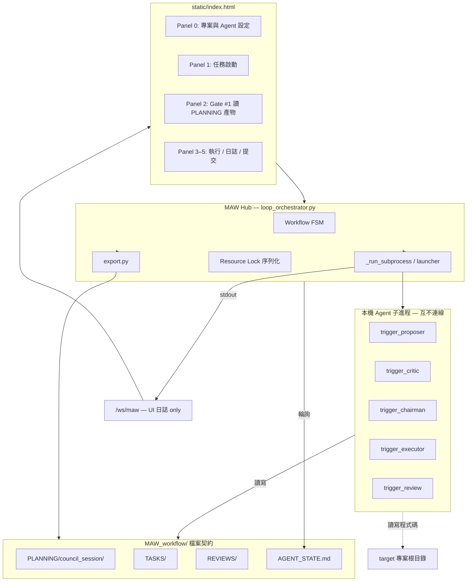

# MAW 全面本機化與多進程架構改造方案

> **Version**: 1.1  
> **Status**: 設計草案 — 待審核後分階段執行  
> **取代範圍**: Phase 6–8 的 context-aware API Council 路線（`project_context` / Scout / Explorer / `llm_provider` 整線退役）  
> **North Star**: MAW 只做 **編排器（Orchestrator）**；Agent 之間透過 **`MAW_workflow/` 檔案契約** 傳遞（與現行 Executor / Reviewer 完全相同），WebSocket **僅供 UI 看日誌**，不作 Agent IPC。所有「思考」與「讀檔」在本機 Agent 子進程內完成，**零外部 LLM API、零 Token 計費、零預先打包上下文**。

---

## 0. 為什麼要改（問題陳述）

現行架構的核心假設是：**Council 透過 HTTP 呼叫遠端模型，MAW 負責把目標專案「讀進 Prompt」**。

實務上這條路徑有結構性缺陷：

| 問題 | 現況 | 本機化後 |
|------|------|----------|
| Token 成本 | L0–L3 context pack + 三階段多模型呼叫，費用不可控 | Agent 自行讀檔，MAW 不計 Token |
| 讀檔複雜度 | `project_context`（~1300 LOC）+ Scout + Explorer + 截斷/審計 | 刪除；Agent 用本機工具讀 `target/` |
| 權限透明度 | MAW 代讀再轉發，使用者難以感知實際觸及範圍 | Agent 進程 = 使用者 OS 身份，路徑由啟動參數明示 |
| 架構厚重 | Council API 層與 Executor 層兩套啟動/通訊模式 | 統一 `adapters/` + **`MAW_workflow/` 檔案契約**（不新增 Agent IPC） |
| 可行性 vs 可用性 | 技術上可行，但無人願意維護 API 金鑰與 context 治理 | 與使用者已有 Agent 工具鏈對齊 |

**結論**：保留 MAW 的 **工作流狀態機、雙重人工閘門、匯出契約、WebSocket 即時日誌**；替換 **Council 的資訊來源與執行載體**。

---

## 1. 目標架構（Target Architecture）

### 1.1 一句話

```text
User → MAW Hub (FastAPI) → spawn 本機 Agent 子進程（Council ×3 → Executor → Reviewer）
         ↓ Hub 只傳 CLI 參數（指向 MAW_workflow/ 內的檔案路徑），不讀 target 原始碼
     <target-project>/MAW_workflow/  ← Agent 之間的 SSOT（檔案契約，與現行後半段相同）
         ↓ stdout/stderr
     /ws/maw  ← 僅轉發日誌給 UI（現有機制，不擴充 room）
```

### 1.2 分層職責



| 層級 | 職責 | 不做 |
|------|------|------|
| **MAW Hub** | `create_subprocess_exec` 啟動 agent、`_run_subprocess` 串流日誌、FSM、Gate、寫入 session 初始檔 | LLM 推論、讀 target 原始碼、Agent 間訊息轉發 |
| **Council Agents** | 讀 `PLANNING/` 上游產物 + target 資料夾，寫入下游 `.md` | 連線其他 agent、連線 WebSocket |
| **Executor / Reviewer** | **現行不變** — `TASKS/`、`AGENT_STATE.md`、`REVIEWS/` | — |
| **`MAW_workflow/`** | 前後段統一 SSOT；Council 用 `PLANNING/council_session/` 子目錄 | — |
| **`/ws/maw`** | UI 訂閱 `task_num` 看 stdout 日誌（`loop_orchestrator._append_log`） | Agent IPC、會議 room |

### 1.3 Council 三角色對照（概念映射）

| 原 Karpathy 階段 | 本機角色 | 進程數 | 行為 |
|------------------|----------|--------|------|
| Stage 1 獨立提案 | **Proposer** | 1+（可配置多 Proposer 再合併） | 讀 target，產出初步實作計畫 |
| Stage 2 匿名互評 | **Council Reviewer** | 1+ | 讀 Stage 1 產出 + target，評議/排序 |
| Stage 3 主席綜述 | **Chairman** | 1 | 彙整為可匯出的最終計畫 Markdown |

> **設計決策**：預設 **3 進程各 1 實例**（符合「三方會議」）。若使用者僅有單一 Agent 執行檔，Hub 以 **Resource Lock 序列化** 依序啟動同一 binary 三次、以 `role` 環境變數區分（見 §4.3）。

---

## 2. 通訊協定 — 沿用 `MAW_workflow/` 檔案契約（不新增 WebSocket room）

### 2.1 設計原則（v1.1 修正）

後半段已驗證的模式：

```text
Hub spawn 子進程 → Agent 讀寫 MAW_workflow/ 檔案 → Hub 等 exit code / 輪詢 AGENT_STATE.md
WebSocket 只轉發 subprocess stdout → UI 看日誌
Agent 之間零網路連線
```

**Council 前半段必須用同一模式**，不為會議另建 WebSocket room。理由：

| 若用 WS 當 Agent IPC | 問題 |
|---------------------|------|
| Agent 需實作 WS client | 與現有 trigger 腳本風格割裂 |
| Hub 需轉發、排序、持久化訊息 | 重複造輪子；檔案已是 SSOT |
| 除錯困難 | 使用者無法直接打開 `.md` 看會議產物 |
| 與 Executor 兩套通訊 | 違背「架構簡潔」目標 |

### 2.2 Council 檔案契約（新增子目錄）

Hub 在啟動 Council 前建立 session 目錄（在 target 的 `MAW_workflow/` 內，git-ignored）：

```text
<target>/MAW_workflow/
├── PLANNING/
│   └── council_session_<id>/
│       ├── prompt.md              # Hub 寫入：使用者任務
│       ├── stage1_propose.md      # Proposer 寫入
│       ├── stage2_review.md       # Critic 寫入（讀 stage1）
│       └── stage3_plan.md         # Chairman 寫入（讀 stage1+2）→ Gate #1 審閱 SSOT
├── scripts/
│   ├── trigger_proposer.py        # adapters 安裝（與 trigger_executor 同模式）
│   ├── trigger_critic.py
│   └── trigger_chairman.py
```

Gate #1 核准後，`export.py` 將 `stage3_plan.md` 複製/渲染為 `PLANNING/council_NNN.md`，並建立 `TASKS/task_NNN.md`（與現行相同）。

### 2.3 編排順序（`local_council.py`）

與 `_spawn_executor` 相同：Hub 依序 `await _run_subprocess(...)`，**等上一階段 exit 0 且 output 檔存在** 才啟動下一階段。

```text
1. Hub 寫 prompt.md
2. spawn trigger_proposer.py  --session-dir ... --prompt prompt.md --out stage1_propose.md
3. spawn trigger_critic.py    --session-dir ... --in stage1_propose.md --out stage2_review.md
4. spawn trigger_chairman.py  --session-dir ... --in stage1,stage2 --out stage3_plan.md
5. state → COUNCIL_PENDING_APPROVAL；UI 用 GET API 讀 stage*.md 顯示 Gate #1
```

**並行模式**（可選）：Stage 1 多個 Proposer 各寫 `stage1_propose_<agent>.md`，Chairman 讀全部。Hub 仍只 spawn + 等檔案，無 WS。

**序列化模式**（VRAM 不足）：`resource_lock.py` 在 Hub 內排隊 spawn，同一時間只跑一個子進程——**不需要** `resource.granted` WS 訊息。

### 2.4 啟動參數（與 Executor 對齊）

```bash
python3 MAW_workflow/scripts/trigger_proposer.py \
  --session-dir MAW_workflow/PLANNING/council_session_abc \
  --prompt prompt.md \
  --output stage1_propose.md
```

Agent 腳本內部：

- `PROJECT_ROOT` = `MAW_workflow` 的上一層（與 mock executor 相同）
- 自行讀取 target 原始碼、自行推理
- 完成後 `sys.exit(0)` + 寫入 `--output`

**不要求** WebSocket client、不要求連線 MAW。

### 2.5 WebSocket — 零改動

| 項目 | 動作 |
|------|------|
| `/ws/maw` | **保留現狀** — subscribe by `task_num`，收 log/status |
| `ws-manager.js` | **不擴充** room |
| Council 日誌 | 來自 `_run_subprocess` 的 stdout（label=`proposer`/`critic`/`chairman`） |
| Gate #1 內容 | UI 透過 `GET /api/maw/council/session/{id}` 讀檔案內容，非 WS 推送 |

---

## 3. 徹底剝離清單（Deletion Manifest）

> **原則**：刪除檔案 + 刪除 import + 刪除測試 + 刪除 UI + 刪除文件，**不留死碼、不留 env 幽靈、不留「暫時 deprecated」**。

### 3.1 整檔刪除（Python / 設定 / 測試）

| 路徑 | 理由 |
|------|------|
| `council/llm_provider.py` | 外部 API 路由 |
| `council/openrouter.py` | OpenRouter 客戶端 |
| `council/direct_resolver.py` | Direct API 探測 |
| `council/vendors.json` | 供應商端點表 |
| `council/council.py` | Karpathy 字串拼接 + `query_model`（由 `local_council.py` 取代） |
| `project_context.py` | Context pack 管線 |
| `scout.py` | Scout 推薦 |
| `explorer.py` | Explorer brief |
| `context_smoke_test.py` | API context E2E |
| `test_llm_provider.py` | — |
| `test_openrouter.py` | — |
| `test_direct_resolver.py` | — |
| `test_project_context.py` | — |
| `test_scout.py` | — |
| `test_explorer.py` | — |
| `test_context_api.py` | — |
| `test_council.py` | 舊 council mock 測試（改寫為 local council 測試） |

### 3.2 文件退役（移至 `docs/archive/` 或刪除）

| 路徑 | 理由 |
|------|------|
| `CONTEXT_AWARE_COUNCIL_REFACTOR_PLAN.md` | 架構已廢棄 |
| `CONTEXT_RELEASE_HARDENING_PLAN.md` | Phase 7 專屬 |
| `CONTEXT_RELIABILITY_PLAN.md` | Phase 8 專屬 |
| `docs/CONTEXT_GOVERNANCE.md` | reasonCode / riskFlags 治理 |
| `docs/PHASE7_UI_CHECKLIST.md` | Context UI 回歸 |
| `docs/PHASE8_UI_CHECKLIST.md` | 未執行即作廢 |

### 3.3 `loop_orchestrator.py` 刪除區塊（精確手術）

| 區塊 | 現行函式/行為 | 動作 |
|------|---------------|------|
| Context 收集 | `_run_council_task` 內 `build_context_pack`、`run_explorer_brief` | **刪除** |
| Auto-approve 審計 | `_can_auto_approve_council` 及 context_audit 分支 | **刪除**（Gate #1 一律人工，或僅保留「使用者勾選」） |
| Chairman API 摘要 | `_chairman_final_summary` → `query_model` | **刪除**（主席在本機進程產出） |
| Council 啟動 | 呼叫 `run_council()` | **替換**為 `LocalCouncilRunner.start()` |

**保留**：`_spawn_executor`、`_spawn_reviewer`、`_monitor_workflow`、Gate #2、`resume_unfinished`、WebSocket 廣播、git commit 流程。

### 3.4 `main.py` 刪除路由

| 路由 | 動作 |
|------|------|
| `POST /api/maw/context/preview` | 刪除 |
| `POST /api/maw/context/explorer/preview` | 刪除 |
| `POST /api/maw/context/scout/dry-run`（若有） | 刪除 |
| `GET /api/setup/llm-models` | 刪除 |
| `POST /api/setup/test-llm` | 刪除 |
| `GET /api/maw/config` 內 `councilModels` / `chairmanModel` | 刪除模型列表 |

**新增**：

| 路由 | 用途 |
|------|------|
| `GET /api/maw/agents` | 列出 registry 內 agent + 支援的 roles |
| `GET /api/maw/council/session/{id}` | 讀取 `PLANNING/council_session_<id>/stage*.md` 供 Gate #1 UI |

### 3.5 `export.py` 簡化

刪除：

- `_render_context_summary`、`contextPack` / `contextAuditSummary` / `autoApprovePolicy` 匯出欄位
- 對 `project_context.build_context_audit_summary` 的依賴

保留：

- `export_to_target`、task slug、atomic lock、`PLANNING/council_NNN.md`（內容改為 **主席最終計畫 + 會議 transcript 連結**）

### 3.6 `static/index.html` 刪除 UI

| 區塊 | 行號參考（約） | 動作 |
|------|----------------|------|
| Panel 0 LLM Provider / LiteLLM / OpenRouter / Direct keys | 156–189 | **刪除** |
| Panel 0 Test Connection | `testLlm()` | **刪除** |
| Panel 1 Council model 多選 + Chairman 下拉 | 303–341, JS 718+ | **刪除** |
| Context bar / file selector / Scout toggle / Explorer toggle | 277–380+ | **刪除** |
| Gate #1 context audit card / provenance tables | 1200–1500 區段 | **替換**為 Council transcript 檢視 |

**新增 Panel 0**：

- Council 三角色 Agent 選擇（Proposer / Critic / Chairman 各選一個 registry agent）
- 「單一 Agent 序列模式」勾選（VRAM 不足時）

**新增 Panel 2 Gate #1**：

- 分頁顯示 `stage1_propose.md` / `stage2_review.md` / `stage3_plan.md`（HTTP 讀檔）
- Chairman 最終計畫即 `stage3_plan.md`

### 3.7 環境變數與依賴

**`.env.example` 刪除**：

```env
LLM_PROVIDER
LITELLM_API_BASE
LITELLM_API_KEY
OPENROUTER_API_KEY
OPENAI_API_KEY
ANTHROPIC_API_KEY
...（所有供應商金鑰）
DEFAULT_COUNCIL_MODELS
DEFAULT_CHAIRMAN_MODEL
```

**保留**：

```env
TARGET_PROJECT_PATH
ALLOW_AUTO_COMMIT
EXECUTOR_TIMEOUT_SECONDS
REVIEWER_TIMEOUT_SECONDS
MAX_REVIEW_ITERATIONS
MAW_MOCK_MODE          # 改為：啟動 mock 本機 agent script，非 API mock
MAW_INFERENCE_SLOTS=1  # Resource Lock 並發上限
```

**`pyproject.toml`**：移除未使用的 HTTP 客戶端依賴（若僅 council 使用）；保留 `fastapi`、`uvicorn`、`websockets`、`httpx`（若 setup 仍需要）。

### 3.8 剝離驗證閘（每階段必跑）

```bash
# 不得再出現外部 LLM 相關符號
rg -i "litellm|openrouter|query_model|build_context_pack|scout_suggestions|run_explorer" \
  --glob '!docs/archive/**' --glob '!*.md'

# 測試
MAW_MOCK_MODE=1 uv run pytest -q
```

---

## 4. 新核心模組設計

### 4.1 目錄結構（改造後）

```text
MAW/
├── main.py                      # 精簡路由
├── loop_orchestrator.py         # FSM + 子進程管理
├── export.py                    # 精簡匯出
├── local_council.py             # NEW: Council 三階段 spawn 編排（呼叫 launcher）
├── resource_lock.py             # NEW: Hub 內 spawn 排隊（可選）
├── adapters/
│   ├── registry.json            # 擴充 council 腳本模板
│   ├── launcher.py              # NEW: 統一 spawn（Council + Executor 共用）
│   ├── installer.py             # 擴充：安裝 trigger_proposer/critic/chairman
│   └── templates/
│       ├── council/             # NEW: 與 executor 同風格的 trigger_*.py.tpl
│       ├── executor/
│       └── reviewer/
├── council/
│   ├── config.py                # 精簡：MOCK_MODE、timeouts
│   └── storage.py               # Gate #1 核准記錄（可選）
├── data/
│   ├── conversations/           # 精簡或移除（產物已在 MAW_workflow/）
│   └── workflows.json
└── static/
    ├── index.html               # 精簡 UI
    └── ws-manager.js            # 不修改
```

### 4.2 `adapters/registry.json` 擴充 schema

```json
{
  "id": "grok_build",
  "label": "Grok Build",
  "kind": "gui",
  "binary": {
    "council": "/Applications/Grok.app/.../grok-cli",
    "executor": null,
    "reviewer": null
  },
  "templates": {
    "council_proposer": "templates/council/grok_proposer.sh.tpl",
    "council_critic": "templates/council/grok_critic.sh.tpl",
    "council_chairman": "templates/council/grok_chairman.sh.tpl",
    "executor": "templates/executor/mock_executor.py.tpl",
    "reviewer": "templates/reviewer/mock_review.js.tpl"
  },
  "supports_roles": ["council_proposer", "council_critic", "council_chairman", "executor", "reviewer"],
  "inference_weight": "heavy"
}
```

`adapters/launcher.py` 統一：

```python
async def spawn_agent(role: str, agent_id: str, *, target_path: str, room: str, ...) -> Subprocess
```

Council 與 Executor 皆呼叫此函式。

### 4.3 `resource_lock.py` — VRAM / 推論序列化（Hub 內排隊）

**問題**：三個 Agent 若各載入本地 LLM，易 OOM。

**策略**（可配置）：

| 模式 | 行為 | 適用 |
|------|------|------|
| `parallel` | 三階段依序 spawn（預設）；每階段結束才下一階段 | CLI Agent 連雲端帳號 |
| `serialized` | `MAW_INFERENCE_SLOTS=1`：全域只有一個 agent 子進程活著 | 本機 GGUF / 單 GPU |

實作：Hub 內 `asyncio.Semaphore`，在 `_run_subprocess` 前 `acquire`、退出後 `release`。**Agent 腳本無需感知鎖**——與現行 executor 相同，啟動即跑。

### 4.4 `local_council.py` — 會議編排

取代 `council/council.py`：

```python
class LocalCouncilRunner:
    async def run_session(
        self,
        orchestrator: LoopOrchestrator,
        wf: dict,
        *,
        prompt: str,
        roster: CouncilRoster,
    ) -> CouncilResult:
        """
        1. 建立 MAW_workflow/PLANNING/council_session_<id>/ + prompt.md
        2. await orchestrator._run_subprocess(trigger_proposer, ...)
        3. await orchestrator._run_subprocess(trigger_critic, ...)
        4. await orchestrator._run_subprocess(trigger_chairman, ...)
        5. 驗證 stage3_plan.md 存在 → COUNCIL_PENDING_APPROVAL
        """
```

**不再包含**：`build_prompt_envelope`、`query_models_parallel`、WebSocket room、jsonl transcript（**會議紀錄 = `stage*.md` 檔案**）。

### 4.5 Workflow Handoff（前後段銜接）

```text
Panel 1 Start
  → LocalCouncilRunner.run_session()
  → state: COUNCIL_RUNNING
  → state: COUNCIL_PENDING_APPROVAL
Gate #1 Approve
  → export_to_target()  # council_NNN.md = chairman plan
  → _spawn_executor()   # 不變
  → ... reviewer → Gate #2 → commit
```

**關鍵**：`export_to_target` 的 `council_NNN.md` 來源改為 `council.final_plan` 的 Markdown，而非 API Stage 3 response。

---

## 5. 實施階段（Phased Migration）

> **禁止 big-bang**：每階段可合併 main、可跑測試、可回滾。

### Phase L0 — 檔案契約與 Mock trigger 腳本（1–2 週）

| 項目 | 內容 |
|------|------|
| 新增 | `local_council.py`、`adapters/launcher.py`、`templates/council/mock_*.py.tpl` |
| 擴充 | `install_adapters` 安裝 `trigger_proposer/critic/chairman.py` |
| Mock | 三個 mock trigger 依序寫入 `stage*.md`（與 mock executor 同風格） |
| 測試 | `test_local_council.py` — 驗證檔案鏈 + exit code |
| 不刪 | 舊 council 路徑，以 `MAW_LOCAL_COUNCIL=1` feature flag 切換 |
| **不碰** | `/ws/maw`、`ws-manager.js` |

**驗收**：`MAW_LOCAL_COUNCIL=1 MAW_MOCK_MODE=1` 跑完三階段後 `stage3_plan.md` 存在。

### Phase L1 — Orchestrator 切換（1 週）

| 項目 | 內容 |
|------|------|
| 修改 | `loop_orchestrator._run_council_task` 預設走 `LocalCouncilRunner` |
| 修改 | `approve_council` 讀取 `stage3_plan.md` |
| 新增 | Panel 2 顯示 `stage*.md`（HTTP） |
| 測試 | 改寫 `test_e2e_workflow.py` |

**驗收**：mock local council 全鏈路到 export。

### Phase L2 — 剝離 LLM 層（3–5 天）

| 項目 | 內容 |
|------|------|
| 刪除 | §3.1 LLM 相關檔案 |
| 刪除 | `setup_api` LLM 函式、Panel 0 LLM UI |
| 刪除 | `test_llm_*`、`test_openrouter`、`test_direct_resolver` |
| 驗證 | `rg` 零殘留 |

### Phase L3 — 剝離 Context 層（1 週）

| 項目 | 內容 |
|------|------|
| 刪除 | `project_context.py`、`scout.py`、`explorer.py` 及測試 |
| 刪除 | context API 路由、UI context bar |
| 刪除 | `export.py` context 區塊 |
| 刪除 | `context_smoke_test.py`、Phase 6–8 文件 |
| 修改 | `README.md` 架構說明 |

**驗收**：repo 體積減 ~55%；pytest 全綠。

### Phase L4 — Registry 統一與真實 Agent（持續）

| 項目 | 內容 |
|------|------|
| 實作 | 各 GUI agent 的 council 啟動腳本（與 executor 同安裝流程） |
| 實作 | `resource_lock` 序列模式實測 |
| 文件 | 單一 `docs/LOCAL_AGENT_SETUP.md` |

### Phase L5 — 收尾

| 項目 | 內容 |
|------|------|
| 刪除 | `MAW_LOCAL_COUNCIL` flag（僅留一條路徑） |
| 刪除 | `council/config.py` 內 `AVAILABLE_MODELS` |
| 更新 | `FINAL_SPEC.md`、`README.md`、`implementation_plan.md` |
| 歸檔 | `docs/archive/context-era/` |

---

## 6. 測試策略（改寫後）

| 類型 | 檔案 | 數量估計 |
|------|------|----------|
| Local council 單元 | `test_local_council.py` | ~15 |
| Council 檔案契約 | `test_council_workflow_files.py` | ~8 |
| Resource lock | `test_resource_lock.py` | ~5 |
| Launcher | `test_adapters.py`（擴充） | +5 |
| Orchestrator | `test_orchestrator.py`（精簡） | ~10 |
| WebSocket | `test_websocket.py` | 不變（現有 4 則） |
| E2E mock | `test_e2e_workflow.py` | 1–3 |
| Export | `test_export.py`（精簡） | ~8 |
| Safety / gates | `test_safety.py` | ~6 |

**目標**：~60–70 測試（較現行 154 少，但覆蓋 **新架構關鍵路徑**）。質優於量。

---

## 7. 風險與緩解

| 風險 | 緩解 |
|------|------|
| Agent binary 路徑各機不同 | registry `binary` 可為 null，Panel 0 讓使用者填絕對路徑，寫入 `~/.agent-cowork/agents.json` |
| 各 Agent 工具介面不同 | Council trigger 模板只約定「讀 session 檔、寫 output 檔」；內部如何叫 Grok/Codex 由模板實作 |
| 三進程同時 GUI 搶焦點 | 預設 headless CLI 模式；GUI 僅 executor |
| 剝離遺漏 import 導致 runtime 爆炸 | Phase L2/L3 末尾跑 `rg` + `python -m compileall` + 全測 |
| Gate #1 審計能力消失 | 改為 **檔案審計**（`stage*.md` 全保留在 `PLANNING/`），可直接 grep |
| 舊 conversation JSON 不相容 | 一次性 migration script 或版本欄位 `schema_version: 2` |

---

## 8. 完成定義（Definition of Done）

改造完成當且僅當：

```text
✓ rg 全 repo 無 litellm / openrouter / build_context_pack / query_model 殘留
✓ .env.example 無任何 API 金鑰欄位
✓ Council 僅透過本機子進程 + MAW_workflow 檔案契約完成三階段（無 Agent WebSocket）
✓ MAW Hub 不讀取 target 原始碼檔案（僅驗證路徑存在與 MAW_workflow 契約）
✓ Executor / Reviewer 與 Council 共用 adapters/launcher
✓ Gate #1 / Gate #2 人工閘門仍有效
✓ export → executor → reviewer → commit 全鏈路在 MAW_MOCK_MODE=1 通過
✓ Phase 6–8 context 文件已歸檔或刪除
✓ README 描述本機多進程架構
```

一句話標準：

```text
MAW 成為輕量編排器：使用者用自己信任的本機 Agent 開會與幹活，
MAW 只負責啟動、排隊、轉發、記錄、閘門與匯出。
```

---

## 9. 建議首批 PR 切分

```text
PR-L0a  council trigger 模板 + install_adapters + 檔案契約 tests
PR-L0b  local_council spawn 編排 + feature flag
PR-L1   orchestrator 切換 + Gate #1 transcript UI
PR-L2   刪除 LLM 層（含 setup + Panel 0）
PR-L3   刪除 context 層（含 export + docs archive）
PR-L4   resource_lock + serialized mode
PR-L5   registry 統一 + 真實 agent 模板 + README
```

---

## 10. 與使用者大綱的對照

| 使用者要點 | 本方案對應 |
|------------|------------|
| 外部 API 完全替換為本機多進程 | §1、§4、`local_council.py` |
| 徹底刪除 llm_provider / direct_resolver / 金鑰 | §3.1、§3.7 |
| 三 Agent 協作 | §2、`PLANNING/council_session_*/stage*.md`（與 Executor 同模式） |
| adapters 統一會議與實作 Agent | §4.2、`launcher.py` |
| export → executor 銜接不變 | §4.5 |
| Resource Lock 防 OOM | §4.3、`MAW_INFERENCE_SLOTS` |
| 厚重架構剝離 | §3（~55–65% 程式移除）、§5 分階段 |

---

---

## 附錄：v1.1 修訂說明

v1.0 誤將 Council 設計為 WebSocket「會議大廳」，與後半段已驗證的 adaptor 模式不一致。v1.1 改為：

- Agent IPC = **`MAW_workflow/` 檔案**（`trigger_proposer` → `trigger_critic` → `trigger_chairman`）
- WebSocket = **UI 日誌 only**（`_run_subprocess` stdout，零改動）
- 刪除 `agent_protocol.py`、WS room、`council_sessions/*.jsonl`

*文件作者：MAW 架構改造草案 v1.1 — 待 Kevin 審核後進入 Phase L0。*